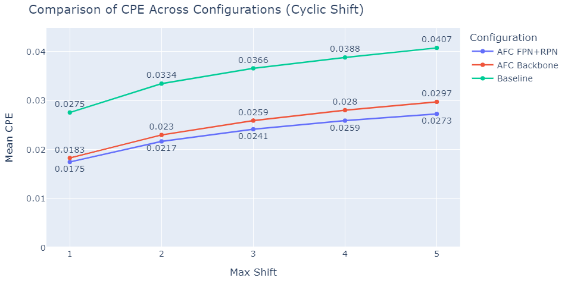

# Shift_Equivariant_Object_Detection
This repository contains the code for the project "Shift Equivariant Object Detection," which is based on the paper [Alias-Free Convnets: Fractional Shift Invariance via Polynomial Activations](https://arxiv.org/pdf/2303.08085dl.acm.org/doi/pdf/10.1145/3591301). The project was conducted by [Nir Tevet]([https://github.com/TamarSdeChen](https://github.com/nirtevet)) and [Hadar Rosenberg](https://github.com/HadarRosenberg), under the supervision of [Hagay Michaeli](https://github.com/hmichaeli) and Daniel Soudry from the Technion, Israel Institute of Technology.
Our project introduces an approach to exstand Alias-Free solution to detection networks to reseved equivariance in the modle.

## Introduction
In the paper Alias-Free Convnets: Fractional Shift Invariance via Polynomial Activations, the authors investigate the difficulties conventional Convolutional Neural Networks (CNNs) face in maintaining true shift invariance. The study highlights that traditional CNNs often suffer from aliasing caused by downsampling layers and non-linearities. These aliasing effects can disrupt shift invariance, leading to unpredictable variations in the network's output when input images are shifted. This limitation poses a significant challenge to the consistency and reliability of CNNs, especially in tasks like image classification and object detection.

The authors propose an anti-aliasing method (AFC) that targets both downsampling and non-linear layers within CNNs. By integrating this approach, they create models that achieve perfect-equivariance and are truly alias-free. This means their CNNs are invariant to both integer and fractional (sub-pixel) translations, enhancing the robustness and reliability of the models. This innovation makes the model more resistant to adversarial attacks that exploit these shifts.

Hagay's method involves replacing traditional non-linear activations with polynomial activations. This is combined with upsampling before the activation and applying a low-pass filter (LPF) followed by downsampling after the activation. Additionally, he substitutes max-pooling layers with blur-pooling and employs similar techniques for layer normalization to ensure alias-free properties throughout the network.

In our project, we take Hagay’s approach from image classification to object detection using the Mask R-CNN architecture with the AFC ConvNext backbone. Mask R-CNN is a well-regarded framework for object detection and instance segmentation, known for its capability to handle various scales and shapes of objects. By incorporating Hagay's alias-free, shift-invariant methods, our project aims to improve the precision and robustness of object detection models. The goal is to develop a system that can accurately detect and segment objects, even in the presence of fractional pixel shifts, making the detection process more reliable and effective.

## Evaluating Model Equivariance with Video Stability Metrics

For evaluating the equivariance of our model, we utilized several video stability metrics from the article [On The Stability of Video Detection and Tracking.](https://arxiv.org/pdf/1611.06467) Specifically, we employed the Center Position Error (CPE) and the Scale and Ratio Error (SRE). Additionally, we introduced 2 novel metrics, Center Position Distance (CPD) – Mean and Worst Case, to provide further insights into the stability of bounding box (BBOX) predictions.

## Results
In general our AFC FPN+RPN network achieve better results on CPE and SRE comperd to the baseline and worse results on the CPE distance.

## more results
## Installation
1. Clone this repository [Swin Transformer Obect Detection](https://github.com/SwinTransformer/Swin-Transformer-Object-Detection) under the base dir.
2. Open dir name detection_tools and clone under it the following repositories:
   * [mmcv](https://github.com/open-mmlab/mmcv)
   * [mmdection](https://github.com/open-mmlab/mmdetection)
   * [cocoapi](https://github.com/open-mmlab/cocoapi)
3. Copy from our code the "project" folder under "Swin Transformer Obect Detection"
4. Clone to the "project" folder the following repository [video_object_detection_metrics](https://github.com/ceykmc/video_object_detection_metrics)
5. Copy the files in our code under "modified_files" folder and enter them to the code as follow:
| File Name      | Destination    | Notes |
|------------------|---------|---------|
| rpn_head.py      | Swin-Transformer-Object-Detection/mmdet/models/dense_heads/rpn_head.py   |    |
| fpn.py           | Swin-Transformer-Object-Detection/mmdet/models/necks/fpn.py    |    |
| mask_rcnn_project_baseline_convnext_tiny_patch4_window7_mstrain_480-800_adamw_3x_coco_in1k.py           | Swin-Transformer-Object-Detection/configs/convnext/   | |
| mask_rcnn_project_convnext_afc_only_backbone_tiny_ideal_up_poly_per_channel_scale_7_7_train_chw2_stem_mode_activation_patch4_window7_mstrain_480-800_adamw_3x_coco_in1k.py | Swin-Transformer-Object-Detection/configs/convnext/   |   |
| mask_rcnn_project_convnext_afc_only_fpn_tiny_ideal_up_poly_per_channel_scale_7_7_train_chw2_stem_mode_activation_patch4_window7_mstrain_480-800_adamw_3x_coco_in1k.py 
| Swin-Transformer-Object-Detection/configs/convnext/ | |
| mask_rcnn_project_convnext_afc_tiny_ideal_up_poly_per_channel_scale_7_7_train_chw2_stem_mode_activation_patch4_window7_mstrain_480-800_adamw_3x_coco_in1k.py | Swin-Transformer-Object-Detection/configs/convnext/ | |
| coco_instance_resize_images.py | Swin-Transformer-Object-Detection/configs/_base_/datasets/ | |
| init_cnn.py | detection_tools/mmcv/mmcv/cnn/ | call it __init__.py in the folder|
| init_cnn_bricks.py | detection_tools/mmcv/mmcv/cnn/bricks/ | call it __init__.py in the folder|
| conv_module.py | detection_tools/mmcv/mmcv/cnn/bricks/ | |
| init_backbone.py | detection_tools/mmdetection/mmdet/models/backbones/| call it __init__.py in the folder|
| convnext_afc.py| detection_tools/mmdetection/mmdet/models/backbones/ | |

## Models
CIFAR-10 models adapted from . 
