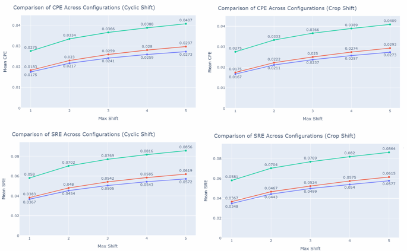

# Shift_Equivariant_Object_Detection
This repository contains the code for the project "Shift Equivariant Object Detection," which is based on the paper [Alias-Free Convnets: Fractional Shift Invariance via Polynomial Activations](https://arxiv.org/pdf/2303.08085dl.acm.org/doi/pdf/10.1145/3591301). The project was conducted by [Nir Tevet]([https://github.com/TamarSdeChen](https://github.com/nirtevet)) and [Hadar Rosenberg](https://github.com/HadarRosenberg), under the supervision of [Hagay Michaeli](https://github.com/hmichaeli) and Daniel Soudry from the Technion, Israel Institute of Technology.
Our project introduces an approach to exstand Alias-Free solution to detection networks to reseved equivariance in the modle.

## Introduction
The paper Alias-Free ConvNets: Fractional Shift Invariance via Polynomial Activations addresses the challenge of achieving true shift invariance in conventional Convolutional Neural Networks (CNNs). Traditional CNNs often struggle with aliasing caused by downsampling layers and non-linearities. To overcome this, the authors propose the Alias-Free Convolution (AFC) method, which modifies both downsampling and non-linear layers using alias-free techniques such as polynomial activations, blur-pooling, and anti-aliasing normalization layers to create an alias-free network.

Building on this, our project extends Hagay’s AFC method from image classification to object detection by integrating it into the Mask R-CNN architecture with the ConvNext backbone. This implementation aims to improve object detection precision and robustness, ensuring reliable performance even under fractional pixel shifts, thereby making the system more effective for real-world scenarios.

## Evaluating Model Equivariance with Video Stability Metrics

For evaluating the equivariance of our model, we utilized several video stability metrics from the article [On The Stability of Video Detection and Tracking.](https://arxiv.org/pdf/1611.06467) Specifically, we employed the Center Position Error (CPE) and the Scale and Ratio Error (SRE). Additionally, we introduced 2 novel metrics, Center Position Distance (CPD) – Mean and Worst Case, to provide further insights into the stability of bounding box (BBOX) predictions.

## Results
We trained and tested on 3 configurations:
 * Baseline without AFC – Green in the graphs.
 * Only update the backbone to be AFC – Red in the graphs.
 * AFC in FPN, RPN and backbone – Blue in the graphs.
In general AFC FPN+RPN network achieve better results on CPE and SRE comperd to the baseline and worse results on the CPE distance.


 AFC FPN+RPN network performs worse on CPE distance than baseline but performs better on CPE distance worst-case cyclic shift.


## Installation
1. Clone this repository [Swin Transformer Obect Detection](https://github.com/SwinTransformer/Swin-Transformer-Object-Detection) under the base dir.
2. Open dir name detection_tools and clone under it the following repositories:
   * [mmcv](https://github.com/open-mmlab/mmcv)
   * [mmdection](https://github.com/open-mmlab/mmdetection)
   * [cocoapi](https://github.com/open-mmlab/cocoapi)
3. Copy from our code the "project" folder under "Swin Transformer Obect Detection"
4. Clone to the "project" folder the following repository [video_object_detection_metrics](https://github.com/ceykmc/video_object_detection_metrics)
5. Copy the files in our code under "modified_files" folder and enter them to the code as follow:

| File Name      | Destination    | Notes |
|-----------------|---------------|-------|
| `rpn_head.py`  | `Swin-Transformer-Object-Detection/mmdet/models/dense_heads/rpn_head.py` | |
| `fpn.py`       | `Swin-Transformer-Object-Detection/mmdet/models/necks/fpn.py` | |
| `coco_instance_resize_images.py` | `Swin-Transformer-Object-Detection/configs/_base_/datasets/` | |
| `init_cnn.py` | `detection_tools/mmcv/mmcv/cnn/` | Call it `__init__.py` in the folder |
| `init_cnn_bricks.py` | `detection_tools/mmcv/mmcv/cnn/bricks/` | Call it `__init__.py` in the folder |
| `conv_module.py` | `detection_tools/mmcv/mmcv/cnn/bricks/` | |
| `init_backbone.py` | `detection_tools/mmdetection/mmdet/models/backbones/` | Call it `__init__.py` in the folder |
| `convnext_afc.py` | `detection_tools/mmdetection/mmdet/models/backbones/` | |

6. Install COCO dataset on you computer and change the dataDir path in the Swin-Transformer-Object-Detection/project/test_runner/test_runner.py
7. Make video_object_detection_metrics and project_utils libraries, go to Swin-Transformer-Object-Detection/project/ and do:
```bash
   pip install -e .
```
8. Clone the work_dirs folder from our code and follow the orders in the "Run tests" section

## Run tests
Use the test_warpper.py in the path Swin-Transformer-Object-Detection/project/test_runner/test_wrapper.py, follow this command structure:

```bash
python test_wrapper.py --threads <num_threads> --max_shift <max_shift_value> --stride <stride_value> [optional flags]
```

### Arguments

#### Required:
- `--max_shift <float>`  
  Specifies the maximum shift value. **(Required)**

#### Optional:
- `--threads <int>`  
  Number of threads to use. **(Default: 4)**

- `--stride <int>`  
  Stride value. **(Default: 1)**

- `-r`, `--random_weights`  
  Use random weights. **(Default: False)**  
  Example: `-r` or `--random_weights`

- `-fpn`  
  Use AFC FPN + RPN config. **(Default: False)**  
  Example: `-fpn`

- `--only-fpn`  
  Use AFC only FPN config. **(Default: False)**  
  Example: `--only-fpn`

- `-is_afc`  
  Use AFC config. **(Default: False)**  
  Example: `-is_afc`

- `-is_cyclic`  
  Use cyclic shift or crop shift. **(Default: False)**  
  Example: `-is_cyclic`

  ** Note to change the path to the config file and the path to the checkpiont to the path of the work_dirs
